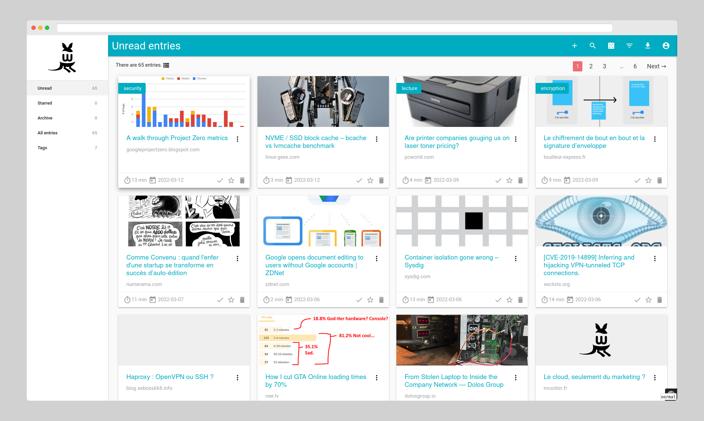

# wallabag


[](https://matrix.to/#/#wallabag:matrix.org)
[](https://liberapay.com/wallabag/donate)
[](https://hosted.weblate.org/engage/wallabag/?utm_source=widget)


wallabag is a web application allowing you to save web pages for later reading.
Click, save and read it when you want. It extracts content so that you won't be distracted by pop-ups and cie.

You can install it on your own server, or you can create an account on [wallabag.it](https://wallabag.it).



* Website: [wallabag.org](https://wallabag.org)
* Android app: [wallabag/android-app](https://github.com/wallabag/android-app)
* iOS app: [wallabag/ios-app](https://github.com/wallabag/ios-app)
* Browser extension: [wallabag/wallabagger](https://github.com/wallabag/wallabagger)
* GNOME (Linux) app: [read-it-later](https://gitlab.gnome.org/World/read-it-later) (not maintained by this project)
* All resources about wallabag ecosystem are listed here: https://github.com/wallabag/wallabag/wiki/wallabag-ecosystem

## Documentation

The documentation is available at https://doc.wallabag.org.

You can contribute to it through its dedicated repository, available here: https://github.com/wallabag/doc.

## Installation

Please read [the documentation to see the wallabag requirements](https://doc.wallabag.org/en/admin/installation/requirements.html).

Then you can install wallabag by executing the following commands:

```bash
git clone https://github.com/wallabag/wallabag.git
cd wallabag && make install
```

Now, [configure a virtual host](https://doc.wallabag.org/en/admin/installation/virtualhosts.html) to use your wallabag.

### Other methods

Refer to the [installation documentation](https://doc.wallabag.org/en/admin/installation/installation.html) for other installation methods.

## Translation

This project uses [Weblate](https://weblate.org/) for translation.

Feel free to help us [translating wallabag](https://hosted.weblate.org/projects/wallabag/).

## Contributing

To learn more about developing wallabag, please refer to the [contribution guide](./.github/CONTRIBUTING.md).

Content extraction relies on [Graby](https://github.com/j0k3r/graby), [php-readability](https://github.com/j0k3r/php-readability) and [ftr-site-config](https://github.com/fivefilters/ftr-site-config).

## Sponsors


## License
Copyright © 2013-current Nicolas Lœuillet <nicolas@loeuillet.org>

This work is free. You can redistribute it and/or modify it under the
terms of the MIT License. See the [COPYING.md](./COPYING.md) file for more details.
