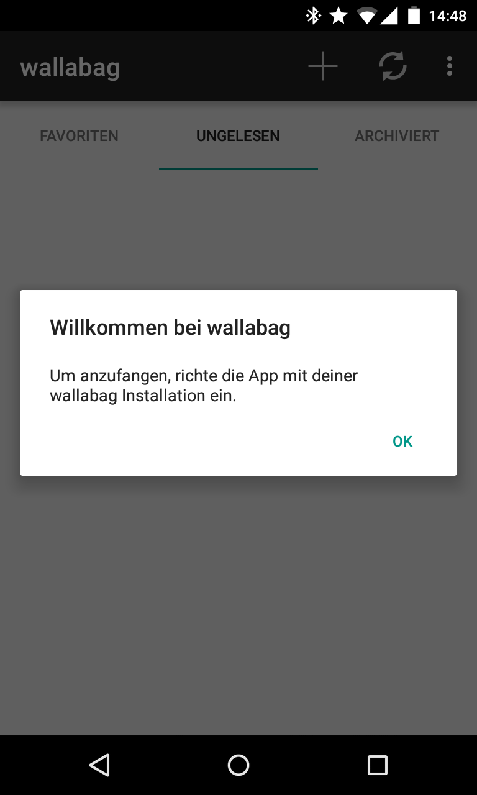
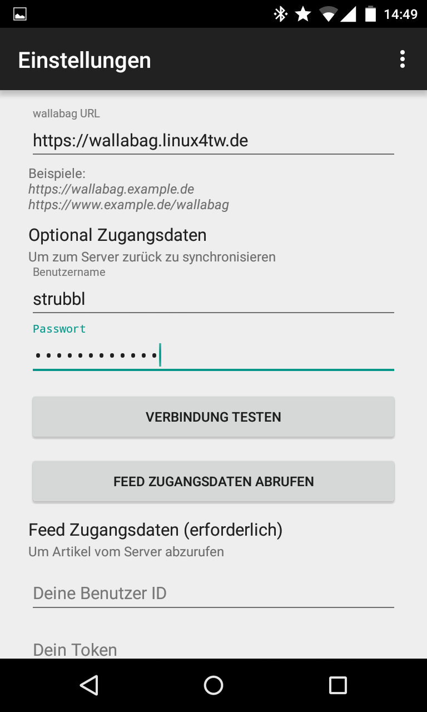
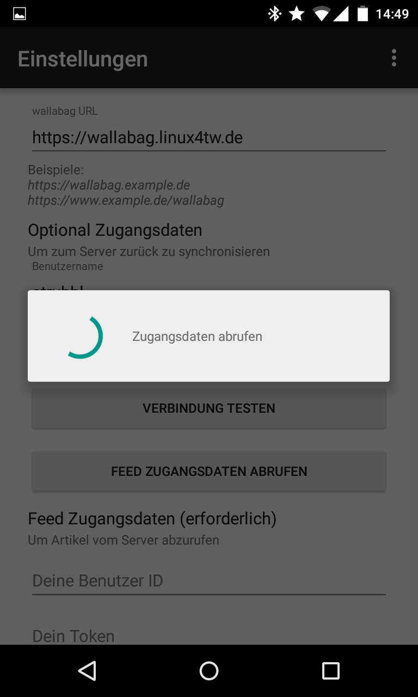
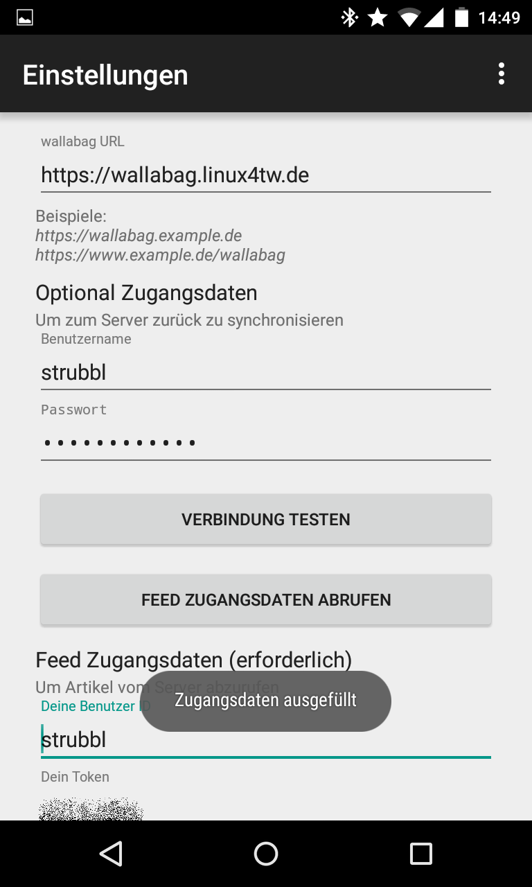

Android App
===========

Zweck dieses Dokuments
----------------------

Dieses Dokument beschreibt wie du deine Android App einrichtest, damit sie mit deiner Wallabaginstanz zusammenarbeitet. Es gibt hierbei keinen Unterschied im Vorgang - egal ob du Wallabag v1 oder v2 einsetzt.

Schritte, um dein App zu einzurichten
-------------------------------------

Wenn du das erste Mal die App startest, siehst du den Willkommensbildschirm, wo du angewiesen wirst zunächst deine App mit deiner Wallabaginstanz einzurichten.

Bestätige nur diese Nachricht und du wirst zum Einstellungsbildschirm weitergeleitet.

.. image:: ../../img/user/android_configuration_screen.de.png
    :alt: Einstellungsbildschirm
    :align: center

Trage deine Wallabagdaten ein. Du musst deine Wallabagadresse eintragen. Es ist wichtig, dass die URL nicht mit einem Schrägstrich endet. Füge auch deine Wallabagzugangsdaten in das Nutzer- und Passwortfeld ein.

Nachdem du deine Daten eingetragen hast, drücke den Button Verbindung testen und warte auf das Fertigstellen des Tests.

.. image:: ../../img/user/android_configuration_connection_test.de.png
    :alt: Verbindungstest mit deinen Wallabagdaten
    :align: center

Der Verbindungstest sollte mit Erfolg ausgehen. Falls nicht, musst du zunächst deine Daten korrigieren bevor du zum nächsten Schritt gehst.

.. image:: ../../img/user/android_configuration_connection_test_success.de.png
    :alt: Verbindungstest war erfolgreich
    :align: center

Nach dem Verbindungstest erfolgreich war, kannst du den Button zum Feedzugangsdaten abholen drücken. Die App versucht nun sich bei deiner Wallabaginstanz einzuloggen und die Nutzer ID und den dazugehörigen Token für die Feeds zu laden.

Wenn der Prozess des Abholens deiner Feedzugangsdaten erfolgreich beendet wurde, siehst du eine Toastnachricht, dass die User ID und der Token automatisch in das Formular eingetragen wurden.

Jetzt scrollst du bis zum unteren Rand des Einstellungsbildschirms. Natürlich kannst du die Einstellungen dort deinen Wünschen anpassen. Schließe die Einrichtung mit dem Drücken des Speicherbuttons ab.

.. image:: ../../img/user/android_configuration_scroll_bottom.de.png
    :alt: unterer Rand des Einstellungsbildschirms
    :align: center

Nachdem du den Speicherbutton gedrückt hast, kommst du in den folgenden Bildschirm. Die App schlägt vor, eine initiale Synchronisation der Artikelfeeds durchzuführen. Hier ist es empfohlen, dies zu bestätigen und Ja zu drücken.

.. image:: ../../img/user/android_configuration_saved_feed_update.de.png
    :alt: Einstellung erstmals gespeichert
    :align: center

Schließlich nach der ersten erfolgreichen Synchronisation, wird dir die Liste der ungelesenen Artikel präsentiert.

.. image:: ../../img/user/android_unread_feed_synced.de.png
    :alt: Gefüllte Artikellist da Feeds erfolgreich synchronisiert sind
    :align: center

Bekannte Limitierungen
---------------------

2FA
~~~

Zur Zeit unterstützt die App keine Zwei-Faktor Authentifizierung. Du solltest sie deaktivieren damit die App funktioniert.

Begrenzte Anzahl Artikel mit Wallabag v2
~~~~~~~~~~~~~~~~~~~~~~~~~~~~~~~~~~~~~~~~

In deiner Wallabaginstanz kannst du einstellen, wie viele Artikel Teil deiner RSS Feeds sind. Diese Option existierte in Wallabag v1 nicht, wo immer alle Artikel Teil des Feeds waren. Also wenn du die Anzahl der Artikel, die in der App angezeigt werden sollen, größer einstellst als die Anzahl Artikel in deinem Feed, wirst du nur die Anzahl an Artikel deines Feeds sehen.

SSL/TLS Verschlüsselung
~~~~~~~~~~~~~~~~~~~~~~~

Wenn du deine Wallabaginstanz per HTTPS erreichen kannst, solltest du das so konfigurieren. Besonders dann, wenn deine HTTP URL nach HTTPS umleitet. Im Moment kann die App mit dieser Weiterleitung nicht korrekt umgehen.

Referenzen
----------

`Quellcode der Android Applikation <https://github.com/wallabag/android-app>`_

`Android Applikation auf F-Droid <https://f-droid.org/repository/browse/?fdfilter=wallabag&fdid=fr.gaulupeau.apps.InThePoche>`_

`Android Applikation auf Google Play <https://play.google.com/store/apps/details?id=fr.gaulupeau.apps.InThePoche>`_

`Support Chat auf English <https://gitter.im/wallabag/wallabag>`_

