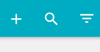
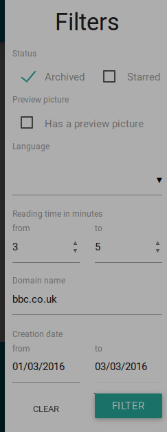

Filter
======

Um Artikel leichter zu erreichen, kannst du sie filtern.
Klicke auf das dritte Symbol in der oberen Leiste.

Alle diese Filter können kombiniert werden.

Status
------

Nutze die Checkboxen, um einen archivierten oder favorisierten Artikel zu finden.

Vorschaubild
---------------

Hake diesen Filter an, wenn du Artikel mit einem Vorschaubild erhalten willst.

Sprache
-------

wallabag (via graby) kann die Artikelsprache erkennen. Es ist einfach für dich, Artikel
in einer bestimmten Sprache zu filtern.

Lesezeit
--------

wallabag schätzt wieviel Zeit du brauchst, um einen Artikel zu lesen. Mit diesem Filter
kannst du zum Beispiel Artikel mit einer Lesezeit zwischen 2 und 5 Minuten finden.

Domainname
----------

Dank dieses Filters, kannst ud Artikel von der gleichen Domain finden.
Zum Beispiel tippst du in diesem Feld ``bbc.co.uk``, um Artikel dieser Website zu finden.

Erstellungsdatum
----------------

Wenn du Artikel speicherst, merkt sich wallabag das aktuelle Datum. So praktisch, um Aritkel, die
zwischen dem 1. und 31. Januar geschrieben sind, zu finden.
