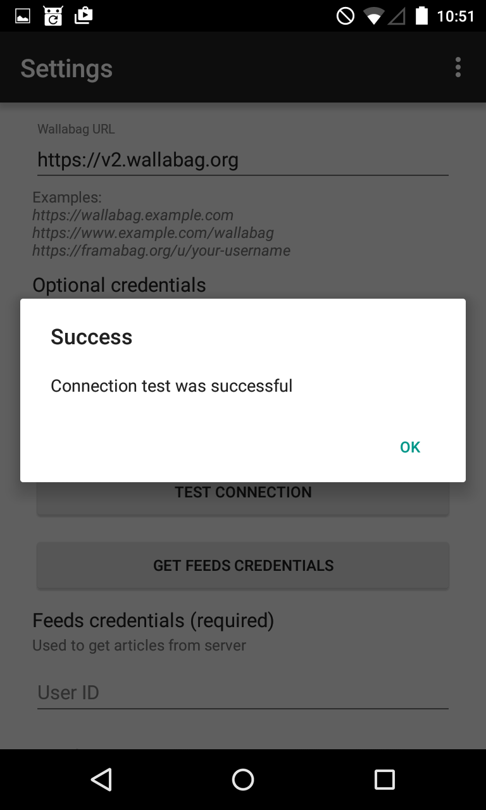
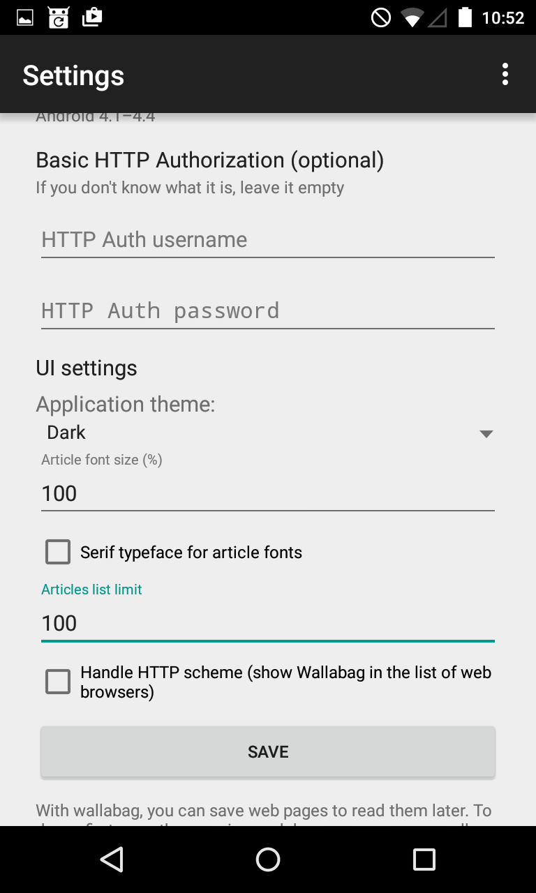
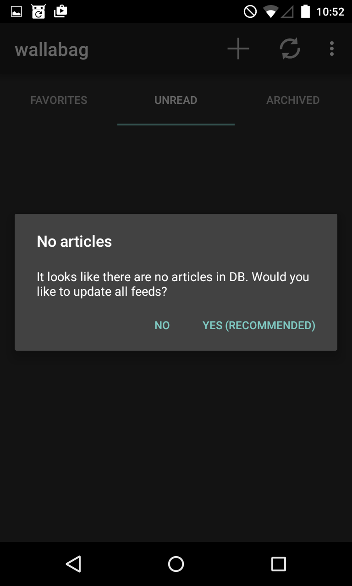

Android application
===================

Purpose of this document
------------------------

This document describes how you can setup your Android application to work with your wallabag instance. There is no difference in this procedure for wallabag v1 or v2.

Steps to configure your app
---------------------------

When you first start the app, you see the welcome screen, where you are adviced to configure the app for your wallabag instance at first.

.. image:: ../../img/user/android_welcome_screen.en.png
    :alt: Welcome screen
    :align: center

Just confirm that message and you get redirected to the settings screen.

.. image:: ../../img/user/android_configuration_screen.en.png
    :alt: Settings screen
    :align: center

Fill in your wallabag data. You need to enter your wallabag address. It is important that this URL does not end with a slash. Also add your wallabag credentials to the user name and password field.

.. image:: ../../img/user/android_configuration_filled_in.en.png
    :alt: Filled in settings
    :align: center

After you have filled in your data, push the button Connection test and wait for the test to finish.

.. image:: ../../img/user/android_configuration_connection_test.en.png
    :alt: Connection test with your wallabag data
    :align: center

The connection test should finish with success. If not, you need to fix this first until you proceed.

After the connection test was successful, you can push the button to get your feed credentials. The app now tries to login to your wallabag instance and get the user id and the corresponding token for the feeds.

.. image:: ../../img/user/android_configuration_get_feed_credentials.en.png
    :alt: Getting the feed credentials
    :align: center

When the process of getting your feed credentials finishes with success you see a toast message that the user id and the token were automatically filled in to the form.

.. image:: ../../img/user/android_configuration_feed_credentials_automatically_filled_in.en.png
    :alt: Getting feed credentials successful
    :align: center

Now you need to scroll to the bottom of the settings menu. Of course you can adjust the given settings to your needs. Finish the configuration of your app with pushing the save button.

After hitting the save button, you get the following screen. The app proposes to initiate a syncronisation process to update your feeds of articles. It is recommended to acknowledge this action and press Yes.

Finally after the synchronisation finished successfully, you are presented to the list of unread articles.

.. image:: ../../img/user/android_unread_feed_synced.en.png
    :alt: Filled article list cause feeds successfully synchronized
    :align: center

Known limitations
-----------------

2FA
~~~

Currently the Android application does not support two-factor authentication. You should disable that to get the application working.

Limited amount of articles with wallabag v2
~~~~~~~~~~~~~~~~~~~~~~~~~~~~~~~~~~~~~~~~~~~

In your wallabag web instance you can configure how many items are part of the RSS feed. This option did not exist in wallabag v1, where all articles were part of the feed. So if you set the amount of articles being displayed greater than the number of items being content of your RSS feed, you will only see the number of items in your RSS feed.

SSL/TLS encryption
~~~~~~~~~~~~~~~~~~

If you can reach your wallabag web instance via HTTPS, you should use that. Especially if your HTTP URL redirects you to the HTTPS one. Currently, the app cannot handle that redirect properly.

References
----------

`Source code of the Android application <https://github.com/wallabag/android-app>`_

`Android Application on F-Droid <https://f-droid.org/repository/browse/?fdfilter=wallabag&fdid=fr.gaulupeau.apps.InThePoche>`_

`Android Application on Google Play <https://play.google.com/store/apps/details?id=fr.gaulupeau.apps.InThePoche>`_

`Support chat <https://gitter.im/wallabag/wallabag>`_

