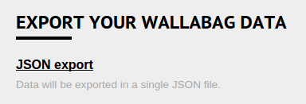
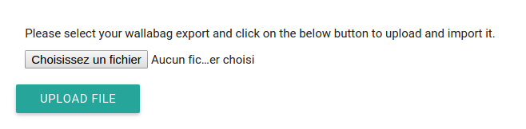

Migrate to wallabag
===================

From wallabag 1.x
-----------------

Export your data from your wallabag 1.x
~~~~~~~~~~~~~~~~~~~~~~~~~~~~~~~~~~~~~~~

On your config page, click on ``JSON export`` in the ``Export your wallabag data`` section.

You will have a ``wallabag-export-1-1970-01-01.json`` file.

Import your data into wallabag 2.x
~~~~~~~~~~~~~~~~~~~~~~~~~~~~~~~~~~

Click on  ``Import`` link in the menu, select your export file on your computer and import it.

All your wallabag 1.x articles will be imported.

From Pocket
-----------

Create a new applicaton on Pocket
~~~~~~~~~~~~~~~~~~~~~~~~~~~~~~~~~

To import your data from Pocket, we use the Pocket API. You need to create a new application on their developer website to continue.

* Create a new application `on the developer website <https://getpocket.com/developer/apps/new>`_
* Fill in the required fields: application name, application description, permissions (only **retrieve**), platform (**web**), accept the terms of service and submit your new application

Pocket will give you a **Consumer Key** (for example, `49961-985e4b92fe21fe4c78d682c1`). You need to configure the ``pocket_consumer_key`` into the ``app/config/parameters.yml`` file in wallabag.

Now, all is fine to migrate from Pocket.

Import your data into wallabag 2.x
~~~~~~~~~~~~~~~~~~~~~~~~~~~~~~~~~~

Click on  ``Import`` link in the menu, on ``Import contents`` in Pocket section and then on ``Connect to Pocket and import data``.

You need to authorize wallabag to interact with your Pocket account. Your data will be imported. Data import can be a demanding process for your server (we need to work on this import to improve it). 

From Instapaper
---------------

*Feature not yet implemented in wallabag v2.*

From Readability
----------------

*Feature not yet implemented in wallabag v2.*

From HTML or JSON file
----------------------

*Feature not yet implemented in wallabag v2.*
