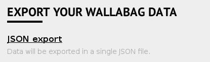
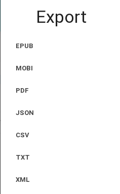

Migrate wallabag
================

From wallabag 1.x
-----------------

If you were using wallabag v1.x, you need to export your data before migrating to wallabag v2.x, because the application and its database changed a lot. In your old wallabag installation, you can export your data, which can be done on the Config page of your old wallabag installation.

.. note::
    If you have multiple accounts on the same instance of wallabag, each user must export from v1 and import into v2 its data.

.. note::
    If you encounter issues during the export or the import, don't hesitate to `ask for support <https://www.wallabag.org/pages/support.html>`__.

When you have retrieved the json file containing your entries, you can install wallabag v2 if needed by following `the standard procedure <http://doc.wallabag.org/en/v2/user/installation.html>`__.

After creating an user account on your new wallabag v2 instance, you must head over to the `Import` section and select `Import from wallabag v1`. Select your json file and upload it.

.. image:: ../../img/user/import_wallabagv1.png
   :alt: Import from wallabag v1
   :align: center

From wallabag 2.x
-----------------

From the previous wallabag instance on which you were before, go to `All articles`, then export these articles as json.

From your new wallabag instance, create your user account and click on the link in the menu to proceed to import. Choose import from wallabag v2 and select your json file to upload it.

.. note::
    If you encounter issues during the export or the import, don't hesitate to `ask for support <https://www.wallabag.org/pages/support.html>`__.

Import via command-line interface (CLI)
---------------------------------------

If you have a CLI access on your web server, you can execute this command to import your wallabag v1 export:

::

    bin/console wallabag:import 1 ~/Downloads/wallabag-export-1-2016-04-05.json --env=prod

Please replace values:

* ``1`` is the user identifier in database (The ID of the first user created on wallabag is 1)
* ``~/Downloads/wallabag-export-1-2016-04-05.json`` is the path of your wallabag v1 export

If you want to mark all these entries as read, you can add the ``--markAsRead=yes`` option.

To import a wallabag v2 file, you need to add the option ``--importer=v2``.

You'll have this in return:

::

    Start : 05-04-2016 11:36:07 ---
    403 imported
    0 already saved
    End : 05-04-2016 11:36:09 ---
