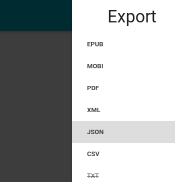

Migrer à wallabag
=================

Depuis wallabag
---------------

Exportez vos données de wallabag 1.x
~~~~~~~~~~~~~~~~~~~~~~~~~~~~~~~~~~~~

Sur la page de configuration, cliquez sur ``Export JSON`` dans la section ``Exportez vos données wallabag``.

.. image:: ../../img/user/export_wllbg_1.png
   :alt: Export from wallabag 1.x
   :align: center

Vous obtiendrez un fichier ``wallabag-export-1-1970-01-01.json``.

Exportez vos données de wallabag 2.x
~~~~~~~~~~~~~~~~~~~~~~~~~~~~~~~~~~~~

Dans la barre latérale de téléchargement, cliquez sur ``JSON``.

Vous obtiendrez un fichier ``Unread articles.json``.

Importez vos données wallabag 2.x
~~~~~~~~~~~~~~~~~~~~~~~~~~~~~~~~~

Cliquez sur le lien ``Importer`` dans le menu, choisissez la version de wallabag correspondante,
sélectionnez votre fichier d'export sur votre ordinateur et importez-le.

.. image:: ../../img/user/import_wllbg.png
   :alt: Import from wallabag 1.x
   :align: center

Tous vos articles wallabag seront importés.

Depuis Pocket
-------------

Créer une nouvelle application dans Pocket
~~~~~~~~~~~~~~~~~~~~~~~~~~~~~~~~~~~~~~~~~~

Pour importer vos données depuis Pocket, nous utilisons l'API de Pocket.
Vous devez créer une nouvelle application sur leur site dédié aux développeurs pour continuer.

* Créez une nouvelle application `sur leur site Développeurs <https://getpocket.com/developer/apps/new>`_
* Remplissez les champs requis : nom de l'application, description de l'application,
  permissions (seulement **retrieve**), la plateforme (**web**), acceptez les
  termes d'utilisation du service et soumettez votre application

Pocket vous fournira une **Consumer Key** (par exemple, `49961-985e4b92fe21fe4c78d682c1`).
Vous devez configurer la ``pocket_consumer_key`` dans le fichier ``app/config/parameters.yml``.

Maintenant, tout est bien configuré pour migrer depuis Pocket.

Importez vos données dans wallabag 2.x
~~~~~~~~~~~~~~~~~~~~~~~~~~~~~~~~~~~~~~

Cliquez sur le lien ``Importer`` dans le menu, sur  ``Importer les contenus`` dans
la section Pocket puis sur ``Se connecter à Pocket et importer les données``.

Vous devez autoriser wallabag à se connecter à votre compte Pocket.
Vos données vont être importées. L'import de données est une action qui peut être couteuse
pour votre serveur (nous devons encore travailler pour améliorer cet import).

Depuis Instapaper
-----------------

*Fonctionnalité pas encore implémentée dans wallabag v2.*

Depuis Readability
------------------

*Fonctionnalité pas encore implémentée dans wallabag v2.*

Depuis un fichier HTML ou JSON
------------------------------

*Fonctionnalité pas encore implémentée dans wallabag v2.*
