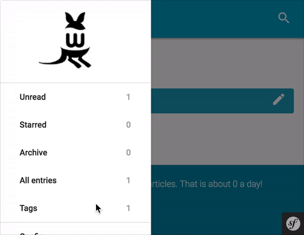

Tags
====

Renommer les tags
-----------------

Sur la page listant tous vos tags, vous pouvez aussi les renommer. Il suffit de
cliquer sur le petit crayon à droite du libellé, de changer le nom et de valider.

Vous pouvez fusionner plusieurs tags en utilisant le même nom.

