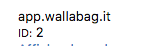

# A cosa servono le impostazioni interne?


Questa documentazione tradotta potrebbe non essere aggiornata. Per funzionalità o requisiti più recenti, consultare la [documentazione inglese](https://doc.wallabag.org/en/).


La pagina delle impostazioni interne è disponibile solo per l'amministratore dell'istanza. Questa permette di gestire impostazioni più sensibili, come l'attivazione di alcune funzioni.

## Analytics

### Abilitare Piwik

`1` per includere il codice Javascript per [Piwik](https://piwik.org/).

### Host del vostro sito su Piwik (senza `http://` o `https://`)

URL per il vostro server Piwik.

### ID del vostro sito su Piwik

L’ID del vostro sito si trova dentro Piwik, in `Settings` -> `Websites` -> `Manage`.

Per esempio:

## Articolo

### URL di Diaspora, se il servizio è abilitato

URL della vostra istanza di Diaspora\*.

### Abilitare autenticazione per siti con paywall

`1` per attivare l’autenticazione per articoli con un paywall (es: Mediapart, Next INpact, etc.).

### URL di Shaarli, se il servizio è abilitato

URL  dell’istanza di Shaarli.

### Abilitare la condivisione con Diaspora

`1` per mostrare il pulsante di condivisione per [Diaspora\*](https://diasporafoundation.org/), `0` per disattivare.

### Abilitare la condivisione per email

`1` per mostrare il pulsante di condivisione per email, `0` per disattivare.

### Autorizzare URL pubblici per gli articoli

`1` per permettere di condividere gli articoli pubblicamente, `0` per disattivare.

### Abilitare la condivisione con Shaarli

`1` per mostrare il pulsante di condivisione per [Shaarli](https://github.com/shaarli/Shaarli), `0` per disattivare.

### Abilitare la condivisione con Twitter

`1` per mostrare il pulsante di condivisione per [Twitter](https://twitter.com/), `0` per disattivare.

### Abilitare la condivisione con Unmark.it

`1` per mostrare il pulsante di condivisione per [Unmark.it](https://unmark.it/), `0`per disattivare.

### Mostrare un link per stampare contenuti
`1` per mostrare il pulsante di stampa, `0` per disattivare.

### URL di Unmark.it, se il servizio è abilitato

URL della vostra istanza di Unmark.it.

## Esportazione

### Abilitare esportazione come CSV

`1` per attivare l’esportazione come CSV, `0` per disattivare.

### Abilitare esportazione come ePub

`1` per attivare l’esportazione come ePub, `0` per disattivare.

### Abilitare esportazione come JSON

`1` per attivare l’esportazione come JSON, `0` per disattivare.

### Abilitare esportazione come .mobi

`1` per attivare l’esportazione come .mobi, `0` per disattivare.

### Abilitare esportazione come PDF

`1` per attivare l’esportazione come PDF, `0` per disattivare.

### Abilitare esportazione come TXT

`1` per attivare l’esportazione come TXT, `0` per disattivare.

### Abilitare esportazione come XML

`1` per attivare l’esportazione come XML, `0` per disattivare.

## Importazione

### Abilitare RabbitMQ per importare i dati in modo asincrono

`1` per attivare RabbitMQ, `0` per disattivare (vedi [Compiti asincroni](../asynchronous.md)).

### Abilitare Redis per importare i dati in modo asincrono

`1` per attivare Redis, `0` per disattivare (vedi [Compiti asincroni](../asynchronous.md)).

## Varie

### Abilitare modalità demo? (usata solamente per la demo pubblica di wallabag)

`1` per attivare la modalità demo, `0` per disattivare (non è possibile modificare l’account utente).

### Utente demo

Nome utente dell’account usato per la demo.

### Scaricare immagini localmente

`1` per attivare il download delle immagini in locale, `0`, per disattivare.

Una volta che questa funzionalità sarà attivata, le immagini degli articoli saranno scaricate nella cartella `/web/assets/images` della vostra istanza di wallabag. Anche il percorso delle immagini negli articoli verrà aggiornato al percorso delle immagini che sono sulla vostra istanza.

### URL di supporto per wallabag

URL usato nelle email inviate da wallabag per qualsiasi richiesta di aiuto.
