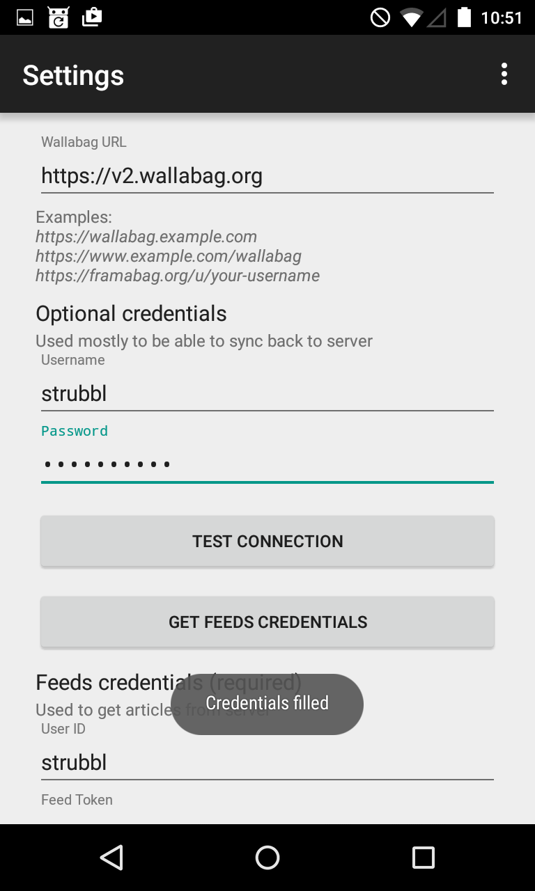

# Applicazione Android


Questa documentazione tradotta potrebbe non essere aggiornata. Per funzionalità o requisiti più recenti, consultare la [documentazione inglese](https://doc.wallabag.org/en/).


## Scopo di questo documento

Questo documento spiega come configurare la vostra applicazione Android
in modo che funzioni con la vostra istanza di wallabag. Non vi è
differenza in questa procedura sia per wallabag v1 che per v2.

## Passi per configurare la vostra app

Quando aprirete l'app per la prima volta, vedrete una schermata di
benvenuto dove vi si consiglia per prima cosa di configurare l'app per
la vostra istanza di wallabag.

Confermate semplicemente quel messaggio e verrete reindirizzati alla
schermata delle impostazioni.

Inserite i vostri dati di wallabag. Dovrete inserire il vostro indirizzo
di wallabag. **È importante che questo URL non finisca con una barra**.
Inserite anche le vostre credenziali nei campi user name e password.

Dopo aver completato l'inserimento dei dati, premete il bottone
Connection test e aspettate che il test finisca.

Il test di connessione dovrebbe finire con successo. In caso contrario,
dovrete prima risolvere questo problema fino a che possiate procedere.

Dopo che il test sarà avvenuto con successo, potrete premere il bottone
per ottenere le credenziali del vostro feed. L'app cercherà di
connettersi alla vostra istanza di wallabag e ottenere l'id utente e il
token corrispondente per i feed.

Quando il processo di ottenimento delle credenziali del vostro feed sarà
concluso con successo, vedrete un messaggio toast, il quale avviserá che
l'id utente ed il token sono stati inseriti nel modulo.

Ora dovrete scorrere fino alla fine del menu delle impostazioni.
Ovviamente potrete cambiare le impostazioni in base alle vostre
preferenze. Terminate la configurazione della vostra app premendo il
bottone per il salvataggio.

Dopo aver premuto il bottone apparirà la seguente schermata. L'app
proporrà di iniziare il processo di sincronizzazione per aggiornare i
vostri feed ed articoli. È raccomandato accettare quest'azione e premere
Sì.

Alla fine, dopo che la sincronizzazione sarà avvenuta con successo,
apparirà la lista degli articoli non letti.

## Limiti conosciuti

### Autenticazione a due fattori (2FA)

Attualmente l'applicazione Android non supporta l'autenticazione a due
fattori. Dovreste disabilitare questa opzione in modo da far funzionare
l'applicazione.

### Quantitá limitata di articoli con wallabag v2

Nella vostra istanza web di wallabag potete configurare quanti oggetti
sono parte del feed RSS. Questa opzione non esisteva in wallabag v1,
dove tutti gli articoli erano parte del feed. Quindi se imposterete il
numero di articoli da visualizzare maggiore del numero di oggetti che
sono contenuti nel vostro feed RSS, vedrete solamente il numero di
oggetti nel vostro feed RSS.

### Crittografia SSL/TLS

Se potete raggiungere la vostra istanza web di wallabag via HTTPS,
dovreste usare quest'ultimo, in particolar modo se il vostro URL HTTP vi
reindirizza a quello HTTPS. Attualmente l'app non può gestire
propriamente il reindirizzamento.

## Riferimenti

-   [Codice sorgente dell'applicazione
    Android](https://github.com/wallabag/android-app)
-   [Applicazione Android su
    F-Droid](https://f-droid.org/repository/browse/?fdfilter=wallabag&fdid=fr.gaulupeau.apps.InThePoche)
-   [Applicazione Android su Google
    Play](https://play.google.com/store/apps/details?id=fr.gaulupeau.apps.InThePoche)

